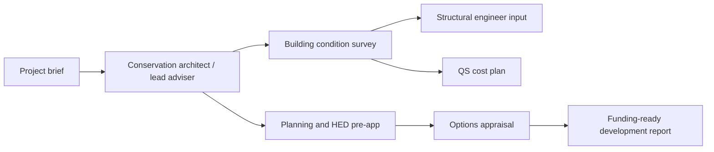

# Consultant Input Pack

**Purpose:** Define the first professional appointments needed to move Fernhill from concept to funding-ready project.  
**Stage:** Pre-design / feasibility development  
**Prepared for:** R.C. and proposed steering group  

---

## 1. Consultant Appointment Principles

The project should appoint consultants in a controlled sequence. Do not commission full design drawings before basic conditions, constraints, and council/HED expectations are known.

Required principles:

- Conservation-led from the outset.
- Clear written scope for each consultant.
- Fixed-fee quotes where possible.
- No reliance on visual inspection alone.
- All outputs must be funder-readable and suitable for AHF/NLHF-style applications.

---

## 2. Appointment Sequence

---

## 3. Conservation Architect / Lead Consultant

### Scope

- Review statutory listing and heritage significance.
- Lead options appraisal.
- Prepare survey brief.
- Identify likely consent requirements.
- Prepare concept-level spatial options.
- Coordinate inputs from surveyor, engineer, QS, access, landscape, and M&E.

### Outputs

- Feasibility options report.
- Conservation principles note.
- Drawings sufficient for discussion, not construction.
- Schedule of further investigations.
- Pre-application pack outline.

### Questions to ask

- What similar listed building projects have you delivered in Northern Ireland?
- Who will lead the conservation work?
- What do you need before giving meaningful cost/design advice?
- How would you phase stabilisation, restoration, and fit-out?

---

## 4. Historic Building Condition Surveyor

### Scope

- Full fabric survey of house and relevant outbuildings.
- Roof, drainage, rainwater goods, walls, openings, floors, plaster, internal joinery.
- Identify water ingress, rot, structural movement, hazardous materials risks.
- Recommend urgent stabilisation works.

### Outputs

- Condition survey report.
- Photographic schedule.
- Priority repairs schedule.
- Indicative urgent works package.
- Recommendations for intrusive investigation.

---

## 5. Structural Conservation Engineer

### Scope

- Review structural movement, roof timbers, floors, retaining/boundary walls, outbuildings.
- Assess immediate stabilisation needs.
- Advise on safe access for surveys and future works.

### Outputs

- Structural appraisal.
- Stabilisation recommendations.
- Risk-ranked intervention schedule.

---

## 6. Quantity Surveyor

### Scope

- Convert parametric estimates into elemental cost plan.
- Separate Phase A stabilisation, Phase B restoration, Phase C fit-out.
- Include contingency, preliminaries, inflation, VAT assumptions, professional fees.

### Outputs

- RIBA-stage appropriate cost plan.
- Risk allowance note.
- Funding package breakdown.
- Cashflow profile by phase.

---

## 7. Planning / Heritage Consultant

### Scope

- Review planning pathway and consent requirements.
- Prepare pre-application strategy.
- Scope Heritage Impact Assessment.
- Identify likely planning risks around parkland, access, trees, noise, and intensification.

### Outputs

- Planning route map.
- Policy compliance matrix.
- HED engagement note.
- Consents checklist.

---

## 8. Transport / Access Consultant

### Scope

- Validate existing parking and access observations.
- Assess pedestrian, bus, taxi, servicing, emergency access, and event-day management.
- Advise on attendance caps and travel plan.

### Outputs

- Access and parking survey.
- Event-day transport plan.
- Accessibility audit.
- Servicing and emergency access note.

---

## 9. Landscape Architect / Arboriculturist

### Scope

- Parkland and tree constraints.
- Overflow parking feasibility.
- Path, lighting, signage, seating, biodiversity.
- Garden/remembrance space options.

### Outputs

- Landscape constraints plan.
- Tree survey / arboricultural impact advice.
- Public realm and access improvements sketch.

---

## 10. M&E / Fire / Licensing Advisers

### Scope

- Heating, ventilation, electrics, catering extract, fire alarm, emergency lighting.
- Commercial kitchen feasibility.
- Fire strategy for public assembly.
- Licensing implications for weddings/events/bar/cinema.

### Outputs

- M&E constraints note.
- Fire strategy assumptions.
- Kitchen/bar feasibility note.
- Licensing checklist.

---

## 11. Consultant Brief Template

Use this short instruction in emails:

> We are preparing a feasibility and development-stage funding package for Fernhill House, a Grade B2 listed building in Glencairn Park, Belfast. We are not seeking full design services yet. We require a development-stage scope, fee proposal, programme, assumptions, and examples of comparable listed building work. Please identify what information you need, what you can deliver within 4-8 weeks, and what risks should be tested before capital funding is pursued.

---

## 12. Documents to Attach to Consultant Enquiries

- One-page brief.
- Two-page brief.
- Statutory listing record.
- Current feasibility study.
- Photographs / map if available.
- Access and transport strategy.
- Draft scope of desired outputs.

