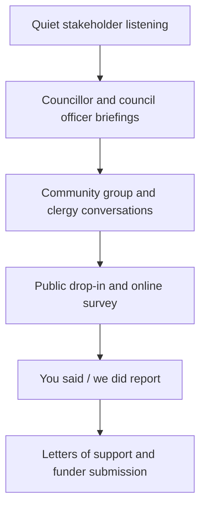
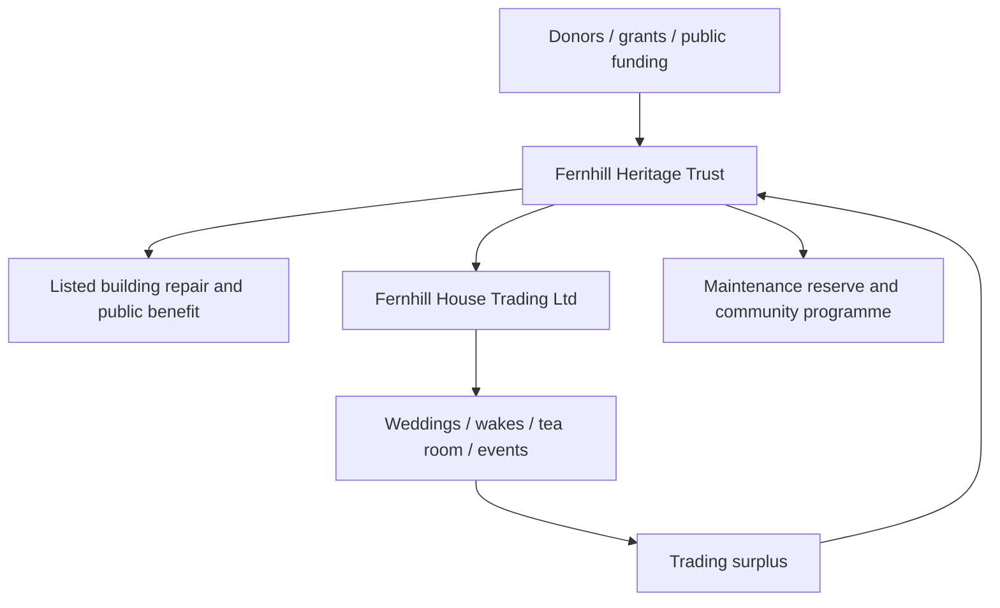
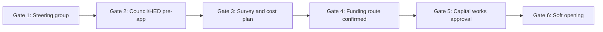

# Fernhill House Full Master Plan and Feasibility Pack v3

**Document status:** Funding-ready / council-ready / consultant-input draft  
**Date:** May 2026  
**Prepared for:** R.C. and the proposed Fernhill steering group  
**Site:** Fernhill House, Glencairn Park, Glencairn Road, Belfast BT13 3PT  
**Core correction:** Fernhill is in the Glencairn / Ballygomartin area of west/northwest Belfast, not south Belfast.  

---

## 1. Executive Summary

Fernhill House is a Grade B2 listed Victorian villa in Glencairn Park, west/northwest Belfast. The statutory listing records it as Fernhill House, Former People's Museum, Glencairn Park, Glencairn Road, Belfast BT13 3PT, in the townland of Ballygomartin [S01]. It has architectural significance, historic associations with Belfast merchant and civic history, group value with its outbuildings, and later social significance as the former People's Museum and the location associated with the 1994 Loyalist ceasefire announcement.

This v3 master plan sets out a feasible route to bring Fernhill back into public and community use as a **heritage-led, community-governed, commercially sustainable venue**. The recommended model is not a museum alone, not a hotel, and not a generic community centre. It is a **multi-use heritage house** with income from carefully managed weddings, wakes/funeral teas, a tea room, community hire, heritage interpretation, learning activity, and small-scale cultural programming.

The proposition is strongest if presented as a **heritage regeneration project with a revenue engine**, rather than as a speculative hospitality business. The public case is preservation, access, local pride, skills, community wellbeing, and place-making. The business case is diversified earned income used to keep the building maintained and active. The governance case is an asset-locked charitable company with a wholly-owned trading subsidiary.

The most important early conclusion is that Fernhill should **not** move immediately to a full capital fundraising campaign. The next fundable step is a **development phase**: professional condition survey, measured access/parking survey, heritage impact scoping, options appraisal, outline business plan, consultation report, and pre-application engagement with Belfast City Council and Historic Environment Division.

---

## 2. Corrected Strategic Positioning

### 2.1 What Fernhill is

Fernhill House should be positioned as:

- A restored listed heritage house in Glencairn Park.
- A community-led venue serving west/northwest Belfast and the wider city.
- A sensitive life-events venue for weddings, wakes, remembrance, and family gatherings.
- A daily public asset through tea room, interpretation, and educational access.
- A platform for heritage skills, volunteering, local supplier spend, and cross-community participation.

### 2.2 What Fernhill is not

Fernhill should not be positioned as:

- A private commercial wedding estate.
- A hotel or accommodation business.
- A high-volume conference venue.
- A purely commemorative or politically aligned museum.
- A project that depends on large new roads or extensive hard-surface car parking.

### 2.3 Funding language

The strongest funding statement is:

> Fernhill House can become a community-led heritage regeneration project that saves a listed building, improves access to Glencairn Park, supports local enterprise, creates skilled employment and volunteering, and generates earned income to protect the asset long term.

---

## 3. Site, Heritage and Planning Context

### 3.1 Site facts

The statutory listing confirms:

- Address: Fernhill House, Glencairn Park, Glencairn Road, Belfast BT13 3PT.
- Date of construction: 1860-1879; historical evidence points to construction by John Smith in the early 1860s.
- Listing: Grade B2, listed 24 March 2016.
- Former use: house; later museum/community museum.
- Current known status in the listing record: vacant / former People's Museum context.
- Architectural interest: Classical-revival villa, original external features, surviving internal decoration.
- Historic interest: merchant history, Cunningham family, Unionist history, former People's Museum, 1994 ceasefire association [S01].

### 3.2 Planning framework

Planning work should be structured around:

- Belfast Local Development Plan Plan Strategy, adopted May 2023 [S09].
- Strategic Planning Policy Statement for Northern Ireland and retained policy context where relevant [S10].
- Listed building and historic environment guidance, including HED expectations.
- Open space, trees, access, movement, parking, sustainable drainage, biodiversity, and climate policy.

The immediate planning route should be **pre-application**, not a full planning submission. The project needs an agreed officer pathway before drawings harden.

### 3.3 Planning policy matrix

| Theme | Policy / guidance source | Fernhill relevance | Required evidence |
|---|---|---|---|
| Listed building | HED, SPPS, historic environment guidance | Works to Fernhill and outbuildings | Heritage Impact Assessment, method statements, conservation schedule |
| Open space / parkland | Belfast LDP, PPS8/SPPS context | Glencairn Park setting | Landscape strategy, public access statement, no-net-loss open space argument |
| Access / transport | Belfast LDP transport SPG, PPS3/SPPS context | Event access, parking, bus, pedestrian links | Measured parking survey, event transport plan, accessibility audit |
| Trees / biodiversity | Belfast LDP SPG, natural heritage policy | Mature parkland trees | Tree survey, arboricultural impact, biodiversity method statement |
| Drainage / flood / SuDS | Belfast LDP SPG | Hardstanding, roofs, kitchens | Drainage feasibility and SuDS strategy |
| Community facilities | Belfast LDP / community infrastructure policy | Tea room, rooms, learning | Community need statement and consultation log |
| Economic regeneration | City/regional economic objectives | Jobs and local procurement | Economic benefit and supply-chain statement |
| Equality / inclusion | Public-sector and funder requirements | Cross-community and accessible use | Equality screening, accessibility plan, inclusion framework |

---

## 4. Access, Transport and Connectivity

The detailed Access, Transport & Connectivity Strategy is held in `research-output/masterplan/fernhill-feasibility-study.md` and was inserted there verbatim as requested. The key operational points for v3 are:

- Existing estate parking is estimated at around 25 vehicles, subject to measured survey.
- Adjacent public/park provision may add around 17 spaces.
- Potential overflow is possible only if landscape-sensitive, permeable, occasional, and agreed with council officers.
- Estimated operational total is around 42-57 vehicles before optimisation, but this must be treated as an observation-based assumption.
- The 11C Metro service connects Belfast city centre, Shankill, and Glencairn/Forthriver areas [S13].
- Forth Meadow Community Greenway strengthens the active travel case, with a 12 km walking/cycling route linking north and west Belfast open spaces [S15].

### Transport assumptions to validate

| Assumption | Status | Required validation |
|---|---|---|
| Estate parking around 25 spaces | Observation | Measured parking layout survey |
| Combined capacity 42-57 spaces | Observation/scenario | Transport consultant layout plan |
| City Hall to Fernhill 30 min public transport | Assumption | Timed journey check by day/time |
| 18 min car journey | Assumption | Timed routing check by day/time |
| Event-day overflow possible | Concept | Council Parks/Planning approval and arboricultural check |

---

## 5. Use Concept and Spatial Logic

### 5.1 Recommended operating zones

The building and grounds should be designed around separation of uses:

- **Public / daily zone:** tea room, interpretation, welcome point, toilets, small displays.
- **Sensitive / remembrance zone:** wake reception room, family room, quiet garden access.
- **Event zone:** wedding ceremony/reception space, bar/servery, event storage.
- **Back-of-house zone:** kitchens, staff welfare, plant, waste, deliveries, linen.
- **Learning and community zone:** flexible room(s), archive/interpretation, small talks.

### 5.2 User conflict matrix

| User group | Potential conflict | Design / operating response |
|---|---|---|
| Tea room visitors | Overlap with wake attendees | Separate entrance/timing; clear signage; acoustic separation |
| Wedding guests | Parking pressure and evening noise | Attendance cap; transport plan; licensing conditions |
| Wake attendees | Need privacy and dignity | Dedicated room, family arrival protocol, trained staff |
| Park users | Perceived privatisation of public space | Keep public routes open; community access commitments |
| Suppliers | Vehicle movements in park | Delivery windows; service route plan |
| Staff / volunteers | Operational complexity | Clear rota, safe working, welfare spaces |

---

## 6. Market and Demand Logic

### 6.1 Weddings

Belfast Castle and Malone House provide verified public-sector pricing benchmarks:

- Belfast Castle ten-hour wedding package: GBP 1,071 for 2025-26 [S02].
- Malone House ten-hour package: GBP 1,044 for 2025-26 [S03].
- Malone House 2026-27 Harberton room rates include GBP 105/hour before 6pm, GBP 115/hour after 6pm, and GBP 1,075 ten-hour block [S04].

Fernhill should not claim proven unmet demand without its own demand study. Instead, the wedding case should be expressed as a scenario:

- Belfast has established heritage wedding comparators.
- West/northwest Belfast lacks an independent heritage house venue anchored in the locality.
- Fernhill can test demand through staged marketing, expressions of interest, and supplier interviews during development.

### 6.2 Wakes and remembrance

The wake/funeral tea opportunity remains strategically strong because it is:

- Local.
- Weekday-weighted.
- Compatible with a house setting.
- More resilient than purely weekend wedding income.

However, funeral director and clergy interviews are essential before finalising pricing, capacity, room flow, and cultural protocols.

### 6.3 Tea room and daily use

The tea room is important for:

- Public access.
- Daily visibility.
- Small but regular revenue.
- Volunteer and learning activity.

It is also operationally risky because it requires staffing, food hygiene systems, utilities, opening discipline, and consistent footfall. It should be phased after minimum viable building safety and service infrastructure are confirmed.

---

## 7. Operating Model

### 7.1 Recommended model

The recommended operating model is:

- **Charity owns/leases/stewards the building and charitable activities.**
- **Trading subsidiary operates commercial events and hospitality.**
- **Surpluses covenant back to the charity** to fund maintenance and public benefit.

### 7.2 Catering decision

The project should choose between three options:

| Option | Benefits | Risks | Recommended position |
|---|---|---|---|
| In-house catering | Highest margin and quality control | Higher capital and staff burden | Year 3+ if demand proven |
| Approved external caterers | Lower startup risk | Lower margin, less control | Best early-stage model |
| Hybrid | Flexible; tea room in-house, events external | Requires strong coordination | Recommended transition route |

### 7.3 Staffing at maturity

Minimum mature staffing assumption:

- Venue Director / General Manager.
- Events and Community Programme Coordinator.
- Tea Room Manager / Head Cook.
- Maintenance / Grounds / Facilities post.
- Casual events, cleaning, bar, and stewarding staff.

The staffing plan must be costed against current wage rates, pension, NI, holiday cover, and weekend premiums.

---

## 8. Financial Model

### 8.1 Revenue streams

| Stream | Role in model | Confidence at this stage |
|---|---|---|
| Weddings | Highest-value event revenue | Medium, needs demand testing |
| Wakes / funeral teas | Weekday anchor | Medium, needs funeral director interviews |
| Tea room | Public access and regular footfall | Medium-low until footfall tested |
| Community room hire | Mission and modest income | Medium |
| Heritage interpretation / talks | Mission, small income | Medium |
| Donations / memberships | Community ownership | Medium |

### 8.2 Scenario summary

The current financial model in v2 should be replaced by three scenarios:

| Scenario | Assumption profile | Purpose |
|---|---|---|
| Downside | Slower wedding uptake, delayed tea room, higher utilities | Tests survival |
| Base | Gradual events growth and controlled staffing | Main business case |
| Upside | Strong event take-up and mature catering | Demonstrates ceiling |

### 8.3 Required financial model tabs

The funding-ready spreadsheet should include:

- Assumptions register.
- Capital cost plan.
- Funding stack.
- Revenue by stream.
- Cost of sales.
- Staffing and overheads.
- Cashflow by month for development and first three operating years.
- Sensitivity tests.
- Maintenance reserve and lifecycle sinking fund.

---

## 9. Capital Cost and Delivery

### 9.1 Current capital envelope

Existing parametric estimate:

- Phase A stabilisation: GBP 250k-450k.
- Phase B core restoration: GBP 600k-1.1m.
- Phase C fit-out: GBP 250k-400k.
- Construction subtotal: GBP 1.1m-1.95m.
- Contingency: 25-35% recommended until survey.
- Professional fees: 12-18%.
- All-in working range: approximately GBP 1.6m-2.9m.

This is **not** a QS cost plan. The next funded work must convert it into an elemental cost plan.

### 9.2 Delivery phases

```mermaid
flowchart LR
  A[Phase 0: Governance and development funding] --> B[Phase 1: Surveys and options appraisal]
  B --> C[Phase 2: Pre-application and design]
  C --> D[Phase 3: Capital funding package]
  D --> E[Phase 4: Stabilisation works]
  E --> F[Phase 5: Core restoration]
  F --> G[Phase 6: Fit-out and commissioning]
  G --> H[Phase 7: Soft opening and operating review]
```

### 9.3 Professional team required

- Conservation architect / lead consultant.
- Chartered building surveyor with historic buildings experience.
- Structural conservation engineer.
- Quantity surveyor.
- M&E engineer.
- Planning consultant.
- Heritage consultant / historian.
- Landscape architect and arboriculturist.
- Access consultant.
- Fire, licensing, and food safety advisers.

---

## 10. Funding Strategy

### 10.1 Priority funding route

The most credible order is:

1. Founding steering group.
2. Charity structure or eligible development vehicle.
3. AHF viability/development support.
4. Condition survey and options appraisal.
5. Council/HED pre-application alignment.
6. NLHF project enquiry / expression of interest.
7. Match package (HEF, trusts, council, philanthropy, community fundraising).
8. Stage 2 capital application.

### 10.2 Funding source matrix

| Source | Likely role | Notes |
|---|---|---|
| Architectural Heritage Fund NI | Early viability/development | Current NI programmes include viability and development-style grants; confirm live limits before applying [S11] |
| NLHF | Main heritage capital funder | Grants from GBP 10k to GBP 10m; larger applications require EOI and development/delivery phases [S12] |
| Historic Environment Fund NI | Listed building development / repair support | 2025 streams included listed building development support, subject to eligibility and annual windows [S17] |
| PEACEPLUS / BCC programmes | Cross-community programming or capital interface | Belfast awarded around GBP 15m / EUR 17.4m for Local Community Action Plan [S16] |
| Community Foundation NI | Community development / local benefit | Useful for engagement and small grants |
| Trusts and foundations | Match funding | Wolfson, Pilgrim, Garfield Weston, Esmee Fairbairn to be checked against eligibility |
| Philanthropy / diaspora | Match and named gifts | Requires prospectus and stewardship plan |
| Social finance | Bridge only | Use only where grants are confirmed or revenue is proven |

---

## 11. Governance

### 11.1 Recommended legal structure

Recommended structure:

- **Fernhill Heritage Trust**: charitable company limited by guarantee, registered with CCNI and Companies House.
- **Fernhill House Trading Ltd**: wholly-owned trading subsidiary for weddings, events, catering, bar, and other non-primary-purpose trading.

This allows the charity to hold the public-benefit mission while the subsidiary manages commercial risk.

### 11.2 Charitable purposes

Likely charitable purposes:

- Advancement of heritage.
- Advancement of education.
- Community development.
- Potential environmental/public amenity benefits.

CCNI requires exclusively charitable purposes and demonstrable public benefit [S19].

### 11.3 Trustee skills matrix

| Role | Required skills |
|---|---|
| Chair | Civic credibility, governance discipline, relationship management |
| Treasurer | Charity accounts, risk, cashflow, audit |
| Heritage trustee | Conservation, HED/planning literacy |
| Community trustee | Local legitimacy across Glencairn/west/northwest Belfast |
| Commercial trustee | Hospitality/events/venue management |
| Legal/governance trustee | Charity law, property, procurement |
| Youth/education adviser | Schools, learning, safeguarding |

---

## 12. Community Engagement Plan

### 12.1 Engagement objectives

- Test community support and concerns.
- Avoid a perception of privatising park space.
- Build cross-community credibility.
- Gather evidence for NLHF/AHF and council.
- Recruit volunteers and future trustees.

### 12.2 Engagement sequence

### 12.3 Engagement outputs

- Stakeholder map.
- Meeting log.
- Public concerns register.
- Consultation summary.
- Letters of support.
- Equality and inclusion summary.
- Volunteer interest list.

---

## 13. Heritage Interpretation Strategy

Fernhill's interpretation should be careful, factual, and balanced. It should cover:

- John Smith and nineteenth-century Belfast merchant history.
- The Cunningham family and Glencairn context.
- Architecture, landscape, outbuildings, and park development.
- People's Museum period.
- 1994 Loyalist ceasefire association.
- Wider Belfast social history and the changing role of country houses.

The tone should be civic and educational, not partisan. Interpretation should be professionally curated, with contested history handled through source-led panels, oral history ethics, and partnerships with heritage bodies.

---

## 14. Sustainability and Environmental Strategy

The environmental strategy should follow a **fabric-first** approach:

- Keep the building dry: roof, rainwater goods, drainage.
- Repair rather than replace historic materials.
- Improve thermal performance only where compatible with heritage fabric.
- Use efficient services with zoned controls.
- Minimise hardstanding in parkland.
- Use permeable surfaces for any overflow parking.
- Protect trees and biodiversity.
- Encourage public transport, walking, cycling, taxis, and car-sharing.
- Build in waste segregation and reusable event systems.

---

## 15. Supplier Ecosystem

The supplier ecosystem is mapped in detail in `research-output/masterplan/supplier-ecosystem-map.md`. The highest-priority categories for the next 90 days are:

- Conservation architect.
- Historic building surveyor.
- Structural conservation engineer.
- Quantity surveyor.
- Planning / heritage consultant.
- Charity solicitor.
- Charity accountant.

Operational suppliers such as event hire, catering wholesalers, security, waste, cleaning, and insurance should be shortlisted later, once uses and scale are clearer.

---

## 16. Risk Register Summary

| Risk | Level | Response |
|---|---|---|
| Condition worse than assumed | High | Commission condition survey and intrusive investigations |
| Capital cost inflation | High | QS cost plan, contingency, phasing |
| Planning / LBC delay | High | Early pre-application with BCC and HED |
| Parking objections | Medium-high | Survey, attendance caps, travel plan |
| Revenue optimism | Medium-high | Scenario model and phased overhead |
| Weak governance | High | Recruit skilled trustees before major applications |
| Community mistrust | Medium | Consultation before public fundraising |
| Political sensitivity | Medium | Neutral interpretation and cross-community board |
| Burnout for R.C. | High | Steering group and delegated workstreams |

---

## 17. Consultant Input Requirements

The project is now ready for **consultant scoping**, not final design. The first consultant asks should be:

1. Conservation architect: options appraisal and survey brief.
2. Building surveyor: condition survey scope and fee.
3. QS: validate capital cost ranges.
4. Structural engineer: structural risk and stabilisation advice.
5. Planning/heritage consultant: pre-application strategy.
6. Transport/access consultant: parking/access validation.

The consultant input pack is provided separately in `research-output/masterplan/consultant-input-pack.md`.

---

## 18. Immediate Action Plan for R.C.

The full action plan is provided separately in `research-output/masterplan/action-plan-pack-rc.md`. The short version:

1. Confirm steering group of 5-7 people.
2. Prepare one-page brief and two-page brief.
3. Brief councillors and request officer introductions.
4. Meet BCC Parks / Estates / Planning / Heritage.
5. Contact AHF NI about eligibility and development funding route.
6. Commission survey specification.
7. Start community listening, not public fundraising.
8. Build consultant quotes and funding-ready document pack.

---

## 19. Readiness Assessment

| Area | Current readiness | Next step |
|---|---|---|
| Vision | Strong | Keep language neutral and funder-oriented |
| Location / heritage facts | Strong | Use verified west/northwest Belfast framing |
| Planning | Medium | Pre-application and policy mapping |
| Capital costs | Medium-low | QS and condition survey |
| Revenue model | Medium-low | Rebuild spreadsheet with scenarios |
| Governance | Medium | Recruit steering group and legal adviser |
| Community support | Low-medium | Start engagement log |
| Supplier route | Medium | Issue consultant scoping requests |
| Funding | Medium | AHF first, NLHF relationship second |

---

## 20. References

- [S01] NI Buildings Register, Fernhill House HB26/38/004A, nidirect. https://apps.communities-ni.gov.uk/Buildings/buildview.aspx?id=17657&js=false
- [S02] Belfast City Council, Belfast Castle wedding packages. https://www.belfastcity.gov.uk/belfastcastle/your-wedding/your-day/wedding-packages
- [S03] Belfast City Council, Malone House wedding packages. https://www.belfastcity.gov.uk/malonehouse/your-wedding/your-day/wedding-packages
- [S04] Belfast City Council, Malone House room hire rates. http://www.belfastcity.gov.uk/malonehouse/meetings-events/room-hire-rates
- [S09] Belfast City Council, Belfast Local Development Plan Plan Strategy adoption and SPG. https://www.belfastcity.gov.uk/Planning-and-building-control/Planning/Local-development-plan-(1)/Local-development-plan/Adoption-of-Plan-Strategy-documents
- [S10] Department for Infrastructure, Strategic Planning Policy Statement / retained planning policy context. https://www.infrastructure-ni.gov.uk/publications/strategic-planning-policy-statement-edition-2
- [S11] Architectural Heritage Fund, Northern Ireland grants. https://ahfund.org.uk/
- [S12] National Lottery Heritage Fund, Northern Ireland and grants guidance. https://www.heritagefund.org.uk/in-your-area/northern-ireland
- [S13] Translink / Bustimes, Metro 11C City Centre - Glencairn. https://bustimes.org/services/11c-city-centre-glencairn
- [S15] Belfast City Council, Forth Meadow Community Greenway. https://www.belfastcity.gov.uk/business-and-investment/physical-investment/peace-iv-shared-spaces/forth-meadow-community-greenway-project
- [S16] SEUPB, Belfast PEACEPLUS Local Community Action Plan award. https://seupb.eu/latest/news/ps15m-peaceplus-investment-awarded-promote-stronger-community-relations-belfast
- [S17] Department for Communities, Historic Environment Fund / Listed Building Development Support. https://communities-ni.gov.uk/topics/historic-environment-funding-grants
- [S19] Charity Commission for Northern Ireland, public benefit and registration guidance. https://www.charitycommissionni.org.uk/register-a-charity/the-public-benefit-requirement/

---

## Appendix A: Core Diagrams

### A1. Governance and money flow

### A2. Development decision gates

---

*End of v3 master plan.*
