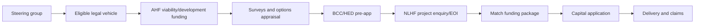

# Funding Roadmap v3

**Purpose:** Practical funding sequence for Fernhill House.  
**Principle:** Do not ask for major capital before survey, governance, council alignment, and match strategy are credible.

---

## 1. Funding Strategy Summary

The right sequence is:

---

## 2. Phase 0: Readiness (0-3 months)

| Task | Output | Owner |
|---|---|---|
| Form steering group | Names, roles, meeting cadence | R.C. |
| Confirm legal pathway | CLG/charity route note | Solicitor |
| Prepare one-page/two-page briefs | Briefing pack | R.C. |
| Contact councillors | Officer introductions | R.C. |
| Meet council officers | Constraints and process note | R.C. / steering |

Funding need: low. Mainly volunteer time and small professional setup costs.

---

## 3. Phase 1: Development Funding (3-12 months)

| Funder | Target use | Notes |
|---|---|---|
| Architectural Heritage Fund | Viability/development work | Confirm live NI grant limits and match requirement |
| Community Foundation NI / local small grants | Community engagement | Useful for listening phase |
| Council / regeneration small grants | Local engagement / feasibility support | Requires officer advice |
| Philanthropic seed gift | Match for surveys | Ask only after scope is clear |

Outputs funded:

- Condition survey.
- Options appraisal.
- Business plan.
- Community engagement.
- Heritage and planning route.
- QS cost plan.

---

## 4. Phase 2: Capital Funding Assembly (12-30 months)

| Source | Role |
|---|---|
| NLHF | Main capital/development-delivery funder if heritage outcomes are strong |
| Historic Environment Fund NI | Repair/development support where annual windows allow |
| Trusts and foundations | Match funding |
| PEACEPLUS / BCC routes | Cross-community or place-based elements only if programme fit exists |
| Community fundraising | Public ownership and match |
| Philanthropy / named gifts | Rooms, garden, interpretation, access upgrades |

Do not rely on one funder. Capital should be stacked in layers.

---

## 5. Phase 3: Delivery Cashflow

Key issue: many grants pay in arrears. The treasurer must prepare:

- Monthly cashflow.
- Claims schedule.
- VAT treatment note.
- Contingency drawdown rules.
- Bridge finance policy.

Bridge finance should only be considered after confirmed grant award and clear claim schedule.

---

## 6. Funding Application Readiness Checklist

- [ ] Legal entity and governing document.
- [ ] Trustees / steering group CV summaries.
- [ ] Building condition survey.
- [ ] Heritage significance statement.
- [ ] Options appraisal.
- [ ] Planning/HED pre-application note.
- [ ] Community engagement report.
- [ ] Cost plan and cashflow.
- [ ] Business plan and scenario model.
- [ ] Risk register.
- [ ] Maintenance and management plan.
- [ ] Match funding table.
- [ ] Letters of support.

---

## 7. First Three Funding Conversations

1. **AHF NI**: "Is this eligible for viability/development support, and what legal form is required?"
2. **BCC officers**: "What technical evidence must be produced before council can support a development-stage proposal?"
3. **NLHF NI**: "Does this concept align with current investment principles, and what would you expect before a project enquiry/EOI?"

