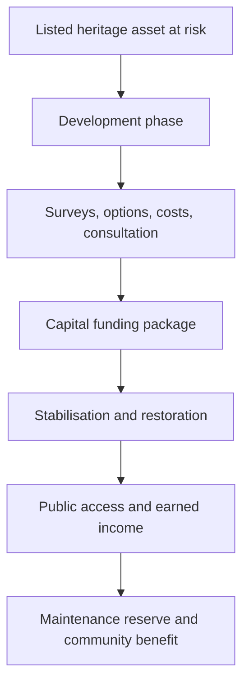
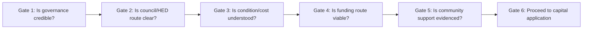
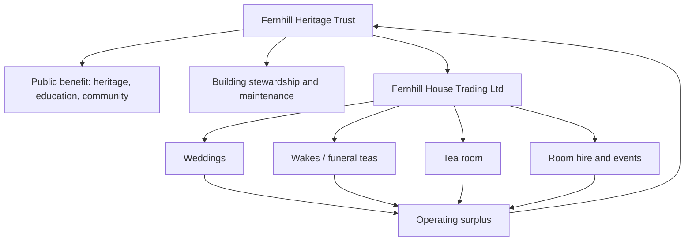
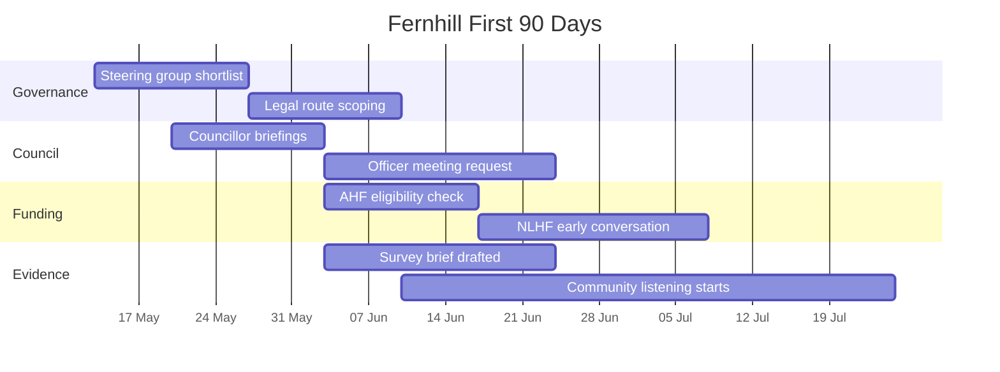
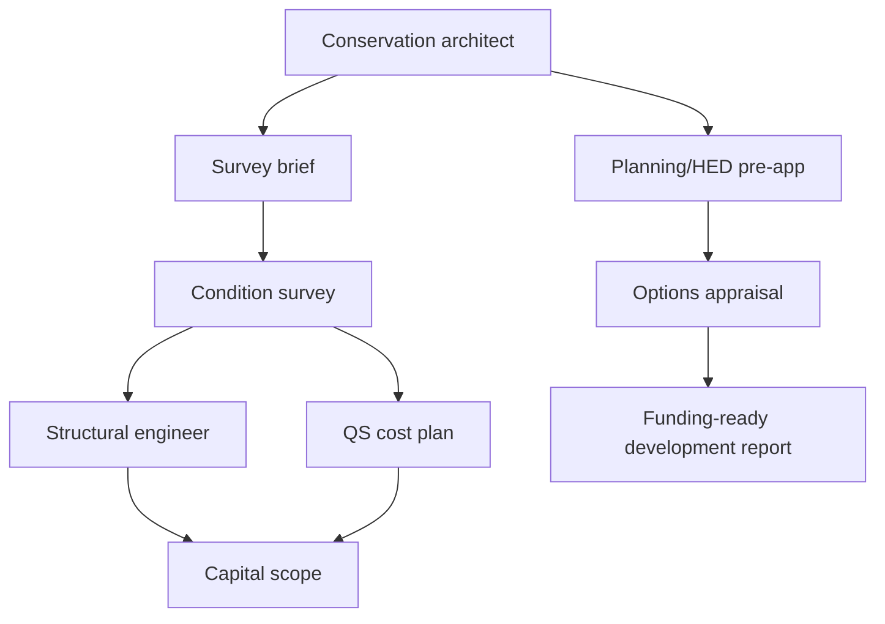

# Tables and Diagrams Pack

**Purpose:** Reusable tables and diagrams for briefings, consultant packs, and funding applications.

---

## 1. Project Logic Diagram

---

## 2. Workstream Map

| Workstream | Lead | Next output |
|---|---|---|
| Governance | R.C. / interim chair | Steering group and legal route |
| Council relations | R.C. | Officer meeting |
| Heritage/planning | Conservation architect | Pre-app strategy |
| Technical | Surveyor/engineer/QS | Condition and cost plan |
| Funding | Fundraising lead | AHF eligibility and NLHF enquiry |
| Community | Engagement lead | Listening log |
| Operations | Venue adviser | Use/zoning/catering model |
| Finance | Treasurer | Scenario model |

---

## 3. Decision Gate Diagram

---

## 4. Capital Cost Structure

| Cost block | Contents | Current range / basis |
|---|---|---|
| Phase A stabilisation | Roof, drainage, urgent weatherproofing, safety | GBP 250k-450k |
| Phase B restoration | Fabric, M&E, access, windows, interiors | GBP 600k-1.1m |
| Phase C fit-out | Kitchen, tea room, event spaces, FF&E | GBP 250k-400k |
| Contingency | Unknowns, inflation, heritage risk | 25-35% recommended |
| Professional fees | Architect, QS, engineers, consultants | 12-18% indicative |

---

## 5. Operating Model Diagram

---

## 6. Stakeholder Matrix

| Stakeholder | Interest | What they need from R.C. | Timing |
|---|---|---|---|
| Councillors | Local mandate and political cover | One-page brief and clear ask | Weeks 1-3 |
| BCC Parks | Park operation and access | Site/access questions | Weeks 2-6 |
| BCC Planning | Consent route | Pre-app scope | Weeks 4-10 |
| HED | Listed building protection | Heritage significance and method | Weeks 4-12 |
| AHF | Development funding | Eligible vehicle and project scope | Weeks 4-12 |
| NLHF | Heritage outcomes and deliverability | Project enquiry and evidence plan | Months 3-9 |
| Community groups | Trust and local fit | Listening process | From Week 4 |
| Clergy/funeral directors | Wake/referral feasibility | Dignity protocol and offer | Months 2-6 |
| Schools | Learning programme | Safeguarding and curriculum fit | Months 3-9 |
| Suppliers | Deliverability | Clear scopes and procurement route | Months 2-12 |

---

## 7. 90-Day Roadmap

---

## 8. Consultant Dependency Diagram

